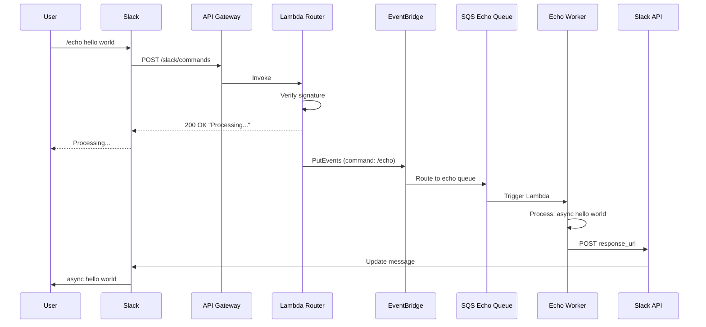

# Slack Bot Architecture - Platform Environment

Event-driven, scalable Slack bot architecture using EventBridge for command routing.

## Quadrant-Based Resource Allocation

This architecture uses a **quadrant-based approach** to optimize Lambda workers and SQS queues based on command characteristics (execution time and side effects). This provides:

- **Security**: Read-only workers have minimal IAM permissions
- **Performance**: Fast commands have low timeouts and high concurrency
- **Resource Efficiency**: Configuration tailored to command needs
- **Isolation**: Write operations don't impact read operations

See [QUADRANT-ARCHITECTURE.md](./QUADRANT-ARCHITECTURE.md) for detailed rationale and configuration matrix.

### Command Categories

| Command | Category | Timeout | Concurrency | Permissions |
|---------|----------|---------|-------------|-------------|
| `/echo` | short-read | 10s | 100 | Read-only (SSM, SQS) |
| `/status` | short-read | 10s | 50 | Read-only (SSM, SQS) |
| `/build` | long-write | 120s | 2 | Scoped write (S3, GitHub) |
| `/deploy` | long-write | 900s | 1 | Scoped write (S3, GitHub) |


## Architecture Diagram

```mermaid
graph TB
    subgraph External
        Slack[Slack Platform]
        SlackAPI[Slack API]
    end

    subgraph AWS["AWS - Platform Environment"]
        APIGW["API Gateway<br/>laco-plt-slack-bot<br/><i>POST /slack/commands</i><br/><i>Timeout: 3s</i>"]

        Router["Lambda: slack-router<br/>• Verify signature<br/>• Return: 'Processing...'<br/>• Publish to EventBridge"]

        EB["EventBridge<br/>laco-plt-chatbot<br/><i>Archive: 7 days</i>"]

        subgraph Echo["Echo Command (Short-Read)"]
            SQS1["SQS: echo<br/>+ DLQ<br/><i>Visibility: 15s</i>"]
            Worker1["Lambda: echo-worker<br/><i>Timeout: 10s</i><br/><i>Concurrency: 100</i>"]
        end

        subgraph Build["Build Command (Long-Write)"]
            SQS2["SQS: build<br/>+ DLQ<br/><i>Visibility: 180s</i>"]
            Worker2["Lambda: build-worker<br/><i>Timeout: 120s</i><br/><i>Concurrency: 2</i>"]
        end

        subgraph Status["Status Command"]
            SQS3["SQS: status<br/>+ DLQ"]
            Worker3["Lambda: status-worker<br/><i>Timeout: 30s</i><br/><i>Concurrency: 5</i>"]
        end
    end

    Slack -->|POST /slack/commands| APIGW
    APIGW --> Router
    Router -->|PutEvents| EB

    EB -->|Rule: /echo| SQS1
    EB -->|Rule: /build| SQS2
    EB -->|Rule: /status| SQS3

    SQS1 --> Worker1
    SQS2 --> Worker2
    SQS3 --> Worker3

    Worker1 -->|Async response| SlackAPI
    Worker2 -->|Async response| SlackAPI
    Worker3 -->|Async response| SlackAPI

    style Slack fill:#4A154B
    style APIGW fill:#FF9900
    style Router fill:#FF9900
    style EB fill:#FF9900
    style SQS1 fill:#FF9900
    style SQS2 fill:#FF9900
    style SQS3 fill:#FF9900
    style Worker1 fill:#FF9900
    style Worker2 fill:#FF9900
    style Worker3 fill:#FF9900
```



## Components

### 1. slack-router
- **Purpose**: Receives Slack commands and routes to EventBridge
- **Timeout**: 3 seconds (Slack requirement)
- **Response**: Immediate acknowledgment
- **Stack**: `cloud-sandbox/aws/10-plt/slack-router/`

### 2. chatbot-eventbridge
- **Purpose**: Routes events to appropriate SQS queues
- **Rules**:
  - `/echo` → echo queue (short-read)
  - `/build` → build queue (long-write)
  - `/status` → status queue (short-read)
  - `/deploy` → deploy queue (long-write)
  - unknown → default queue
- **Stack**: `cloud-sandbox/aws/10-plt/chatbot-eventbridge/`

### 3. Workers

#### Echo Worker
- **Purpose**: Responds with "async <text>"
- **Category**: Short-Read (Q1)
- **Timeout**: 10 seconds
- **Concurrency**: 100
- **IAM**: Read-only (SSM, SQS, X-Ray)
- **Stacks**:
  - SQS: `chatbot-echo-sqs/`
  - Lambda: `chatbot-echo-worker/`

#### Build Worker
- **Purpose**: Triggers GitHub Actions workflows to build Lambda artifacts
- **Category**: Long-Write (Q4)
- **Timeout**: 120 seconds
- **Concurrency**: 2 (limited for safety)
- **Memory**: 512 MB
- **IAM**: Scoped write (S3 artifacts, GitHub PAT)
- **Stacks**:
  - SQS: `chatbot-build-sqs/`
  - Lambda: `chatbot-build-worker/`

#### Status Worker
- **Purpose**: Reports system status
- **Timeout**: 30 seconds
- **Concurrency**: 5
- **Stacks**:
  - SQS: `chatbot-status-sqs/`
  - Lambda: `chatbot-status-worker/`

## Event Flow

### Example: `/echo hello world`



1. **User sends command**
   ```
   User → Slack: /echo hello world
   ```

2. **Slack sends webhook**
   ```json
   POST https://xxx.execute-api.ca-central-1.amazonaws.com/slack/commands
   {
     "command": "/echo",
     "text": "hello world",
     "response_url": "https://hooks.slack.com/...",
     "user_id": "U123",
     "channel_id": "C123"
   }
   ```

3. **Router receives and responds**
   ```javascript
   // Verify Slack signature
   verifySlackSignature(headers, body);

   // Immediate response (< 3 seconds)
   return {
     statusCode: 200,
     body: JSON.stringify({
       response_type: "ephemeral",
       text: "Processing your command..."
     })
   };

   // Publish to EventBridge
   await eventBridge.putEvents({
     Entries: [{
       Source: "slack.command",
       DetailType: "Slack Command",
       Detail: JSON.stringify({
         command: "/echo",
         text: "hello world",
         response_url: "...",
         user_id: "U123",
         channel_id: "C123"
       }),
       EventBusName: "laco-plt-chatbot"
     }]
   });
   ```

4. **EventBridge routes to SQS**
   - Matches rule: `/echo` → `laco-plt-chatbot-echo` queue
   - Event sent to SQS

5. **Worker processes message**
   ```javascript
   // Lambda triggered by SQS
   const message = JSON.parse(event.Records[0].body);

   // Process command
   const response = `async ${message.text}`;

   // Send to Slack
   await axios.post(message.response_url, {
     response_type: "in_channel",
     text: response
   });
   ```

6. **User sees response**
   ```
   Bot → Channel: async hello world
   ```

## Deployment Order

```bash
# 1. SQS Queues (no dependencies)
cd cloud-sandbox/aws/10-plt
terragrunt run-all apply --terragrunt-include-dir chatbot-*-sqs

# 2. EventBridge (depends on SQS)
cd chatbot-eventbridge
terragrunt apply

# 3. Router (depends on EventBridge)
cd ../slack-router
terragrunt apply

# 4. Workers (depend on SQS)
cd ..
terragrunt run-all apply --terragrunt-include-dir chatbot-*-worker
```

## Monitoring

### CloudWatch Metrics
- API Gateway: Request count, latency, errors
- Lambda: Invocations, errors, duration, throttles
- SQS: Messages sent, received, DLQ depth
- EventBridge: Invocations, failed invocations

### CloudWatch Logs
- `/aws/lambda/laco-plt-slack-router`
- `/aws/lambda/laco-plt-chatbot-echo-worker`
- `/aws/lambda/laco-plt-chatbot-deploy-worker`
- `/aws/lambda/laco-plt-chatbot-status-worker`

### Alarms (Recommended)
```hcl
# DLQ depth > 0 (messages failed 3 times)
# Lambda errors > 5%
# API Gateway 5xx > 1%
# EventBridge failed invocations > 0
```

## Scaling

### Current Configuration
- Echo: 100 concurrent executions (short-read)
- Build: 2 concurrent executions (long-write)
- Status: 5 concurrent executions (short-read)
- Deploy: 2 concurrent executions (long-write)

### To Scale
Edit `reserved_concurrent_executions` in worker terragrunt.hcl:
```hcl
inputs = {
  reserved_concurrent_executions = 10  # Increase

  event_source_mappings = [
    {
      scaling_config = {
        maximum_concurrency = 10  # Match
      }
    }
  ]
}
```

## Adding New Commands

1. **Create SQS queue**
   ```bash
   cp -r chatbot-echo-sqs chatbot-newcmd-sqs
   # Edit terragrunt.hcl
   ```

2. **Create worker**
   ```bash
   cp -r chatbot-echo-worker chatbot-newcmd-worker
   # Edit terragrunt.hcl
   ```

3. **Add EventBridge rule**
   ```hcl
   # In chatbot-eventbridge/terragrunt.hcl
   {
     name = "laco-plt-chatbot-newcmd"
     event_pattern = jsonencode({
       source = ["slack.command"]
       detail-type = ["Slack Command"]
       detail = {
         command = ["/newcmd"]
       }
     })
     targets = [{
       arn = dependency.newcmd_sqs.outputs.queue_arn
     }]
   }
   ```

4. **Deploy**
   ```bash
   terragrunt run-all apply
   ```

## Cost Optimization

- **API Gateway HTTP** (not REST): ~$1/million requests
- **Lambda ARM64**: 20% cheaper than x86
- **SQS Long Polling**: Reduces empty receives
- **Reserved Concurrency**: Prevents runaway costs
- **CloudWatch Logs Retention**: 7 days (not indefinite)

## Security

- **Slack Signature Verification**: Prevents unauthorized requests
- **IAM Least Privilege**: Each Lambda has minimal permissions
- **Parameter Store**: Secrets fetched at runtime
- **VPC**: Not used (Slack is public endpoint)
- **DLQ**: Failed messages retained for investigation

## Troubleshooting

### Command not responding
1. Check API Gateway logs
2. Check router Lambda logs
3. Verify Slack signature verification

### Async response not arriving
1. Check EventBridge metrics (failed invocations)
2. Check SQS DLQ depth
3. Check worker Lambda errors
4. Verify `response_url` is valid

### High latency
1. Check Lambda cold starts (increase memory)
2. Check SQS queue depth (increase workers)
3. Check external API calls (Slack, GitHub, etc.)
